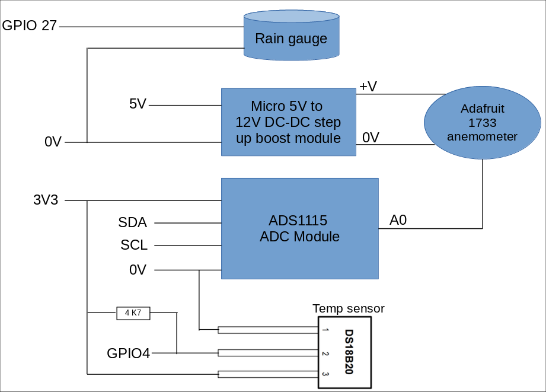

# A Raspberry Pi weather station

This is the repo for my [Raspberry Pi based weather station](https://www.oasw.co.uk/weather/about.html) Based around the original Raspberry Pi Model A, I first set this up in 2017 to simply provide a live external temperature reading. At the back end of 2018, I added firstly a wind annemometer, then rain guague and started logging the data. 

There are 3 components: the station itself, the logging software and a set of web pages which display the data.

## Station

### Hardware

The weather station itself comprises the Raspberry Pi, connected via it's GPIO to a DS18b20 temperature sensor and the (tipping bucket) rain gauge. The annemometer interfaces to an [AdaFruit ADS1115 ADC board](https://www.adafruit.com/product/1085), which in turn connects to the Pi via I2C. An additional DC/DC converter is used to provide the necessary voltage to the annemometer.



The annemometer is also [available from AdaFruit](https://www.adafruit.com/product/1733). There's not a lot of documentation on this, included in the repo is a [badly formatted PDF of the datasheet](station/C2192+datasheet_en.pdf) after pushing it through Google translate.

The rain gauge is intended for a Misol weather station, I originally picked this up on ebay & they still appear to be available.


If you haven't already, I strongly suggest having a read through my write up in the link at the top of the page, this has a lot more detail of my experiences of running this setup for a number of years.

## Software

The software running on the station consists of a fairly simple [Python script](station/temp_broadcast.py). This simply polls each of the sensors in turn, then generates a text string of the form:

`<unix timestamp> <temperature> <wind speed> <rainfall>`

This is sent out as a UDP broadcast packet on port 52003. On my Raspberry Pi, an update is sent out aproximately once a second. The temperature and wind speed readings are taken directly from the sensors. The rainfall figure represents the total amount that has fallen in a 24 hour period (it is reset back to zero at midnight each day) and is the only state data that is held by the station. It's all written to a text file under _/var/cache/rainfall.txt_ each time the gauge triggers. In the event the script is interrupted, the file will be reloaded and used to populate the rainfall figure when it is next started.

The script itself is written for Python 2.7, my Pi runs the (Raspberry Pi flavour) of Debian 8. Both of these are obviously quite old now so expect some work if you intend deploying it on a newer OS and/or version of Python.

## Logger

The logger software also consists of a [Python script](logger/weather_receiver.py). This listens for the broadcast packets sent by the station, it uses this to maintain a XML file (_weather.xml_)which tracks the day's weather statistics - current temperature/wind, maximum, minimum values etc. At midnight each data, it writes the statistics for the day to a MySQL (or Maria) database before resetting everything ready for the following day. In a similar manner to the station, if the script is interrupted for any reason, it will reload the day's settings from the XML file (if present) when restarted.

```
<weather>
<temperature>
<current timestamp="1758221329">18.125</current>
<max timestamp="1758201496">21.437</max>
<min timestamp="1758172092">16.75</min>
<hourly_readings>
...
</hourly_readings>
</temperature>
<wind_speed>
<current timestamp="1758221329">0.99089274375</current>
<max_last_10_mins timestamp="1758221270">2.559334401</max_last_10_mins>
<min_last_10_mins timestamp="1758220989">0.08493366375</min_last_10_mins>
<avg_last_10_mins>0.533066639441</avg_last_10_mins>
<max_last_hour timestamp="1758218397">4.30330563</max_last_hour>
<min_last_hour timestamp="1758219971">0.0792714195</min_last_hour>
<avg_last_hour>0.765638084591</avg_last_hour>
<max timestamp="1758189816">7.92147970575</max>
<min timestamp="1758196693">0.0566224425</min>
<day_average samples="84862" totals="121847.617623">1.43583250009</day_average>
<hour_average samples="3491" totals="2410.25883439">0.690420748893</hour_average>
<hour_max>3.4766179695</hour_max>
<hourly_readings>
...
</hourly_readings>
</wind_speed>
<rain>
<total timestamp="1758221329">1.1176</total>
<last_10_mins>0.0</last_10_mins>
<last_hour>0.0</last_hour>
<hourly_readings>
<hour value="0">0.0</hour>
<hour value="1">0.0</hour>
<hour value="2">0.2794</hour>
```
  
The script can run on any Linux (or possibly Windows) box, in my case I also happen to run it on another Raspberry Pi. To avoid the likelihood of lifeing the SD cards (or maybe just because I'm paranoid!), the XML file is written to the _/dev/shm/_ folder (which is essentially a RAM disc). The downside to this of course is that this will get lost in the event of a power interruption - you can of course relocate this if you wish.

The script is also written for Python 2.7, so again some work will probably be required if you want to move it to a newer version.

## Web pages

Within the [web](web/) folder are a colllection of PHP scripts which are designed to exploit the weather data, this includes not only the live data from the current day but also the historical data and view it in various ways (including graphically).


The main [index.php](web/index.php) script parses the XML file maintaned by the logger in order to generate the current day's set of readings (including the live updates). It expects the _weather.xml_ file to be in the same folder, in my case (since the logger runs on the same machine), I simply create a symbolic link to the version in _/dev/shm/weather.xml_. The historical data (including those generated from the child scripts) is obtained by directly querying the MySQL database.

The static graphs use the [pChart library](https://pchart.sourceforge.net/index.php) however this library is fairly old now (only works up to PHP 5) and the original author is no longer maintaining it. The latest version known to work on PHP 7 and newer is the pChart 2.1 library for PHP 7 (7-Compatible branch) from [github.com/bozhinov/pChart2.0-for-PHP7](https://github.com/bozhinov/pChart2.0-for-PHP7). The scripts expect this to be located on the server, one level back in a folder named pchart.  


The dynamic wind graph is generated by the [Smoothie Charts javascript library](http://smoothiecharts.org/), you'll need to drop a copy of this in the same folder as the web scripts.


